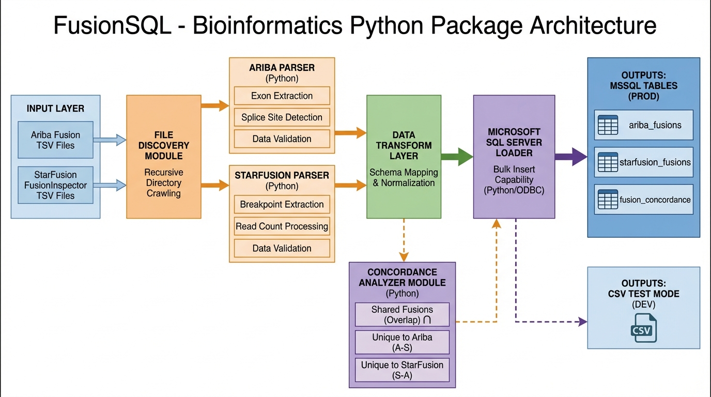
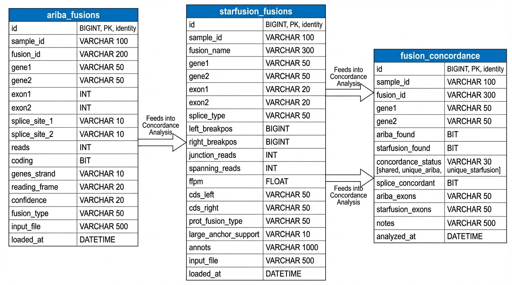

# FusionSQL — Gene Fusion Analysis Pipeline
### Presentation Deck

---

## Slide 1: Overview

### What is FusionSQL?

**FusionSQL** is a bioinformatics data pipeline that:

- Parses gene fusion calls from **Arriba** and **STARFusion + FusionInspector**
- Loads results into **Microsoft SQL Server**
- Analyzes **concordance** between callers

### Input Tools

| Tool | Type | Output |
|------|------|--------|
| **Arriba** | Standalone fusion caller | TSV with splice sites, reading frame |
| **STARFusion + FusionInspector** | Same tool suite | Validated fusion calls with deep annotation |

---

## Slide 2: System Architecture



### Data Flow

1. **File Discovery** — Recursive scan for Ariba/STARFusion files
2. **Parsing** — Extract fusion data with annotations
3. **Loading** — Append to MSSQL tables
4. **Concordance** — Merge results, identify shared/unique fusions

---

## Slide 3: Database Schema



### Tables

| Table | Purpose | Partition Key |
|-------|---------|--------------|
| `ariba_fusions` | Arriba fusion calls | run_id + sample_id |
| `starfusion_fusions` | STARFusion calls | run_id + sample_id |
| `fusion_concordance` | Merged concordance results | run_id + sample_id |

### Design Principles

- **Append-only** (no upsert)
- **Partitioned** by run_id + sample_id
- **Configurable** table names

---

## Slide 4: CLI Usage

### Database Mode

```bash
fusql run /path/to/samples \
  --run-id RUN001 \
  --sample-id SAMPLE_001 \
  --mssql "Server=...;Database=..." \
  --table-ariba ariba_fusions \
  --table-starfusion starfusion_fusions
```

### Test Mode (TSV)

```bash
fusql run /path/to/samples \
  --run-id RUN001 \
  --sample-id SAMPLE_001 \
  --test-mode \
  --output ./tsv_results
```

### Individual Steps

```bash
# Parse Arriba
fusql parse-ariba input.tsv --run-id RUN001 --sample-id SAMPLE_001

# Parse STARFusion
fusql parse-starfusion input.tsv --run-id RUN001 --sample-id SAMPLE_001

# Merge & Analyze Concordance
fusql merge --ariba ariba.tsv --starfusion starfusion.tsv --output merged.tsv
```

---

## Slide 5: Concordance Analysis

### Output Categories

| Status | Description |
|--------|-------------|
| **shared** | Found by both Arriba AND STARFusion |
| **unique_ariba** | Only Arriba detected this fusion |
| **unique_starfusion** | Only STARFusion detected this fusion |

### Metrics

- **Splice concordance** — Are both callers finding splice sites?
- **Fusion overlap rate** — Percentage of shared fusions
- **Caller-specific findings** — Novel calls from each tool

---

## Slide 6: Repository Structure

```
starfusion_itd/
├── fusql/                      # Python package
│   ├── parsers/               # Arriba, STARFusion parsers
│   ├── discovery/             # File finder, scanner
│   ├── loaders/               # MSSQL, TSV loaders
│   ├── concordance/           # Merger, analyzer
│   └── cli.py                 # Command-line interface
│
├── ITD/                       # Existing ITD detection code
│
├── tests/fixtures/            # Test data
│   ├── ariba_fusions.tsv
│   └── starfusion_fusions.tsv
│
├── docs/                      # Documentation
│   ├── fusql_architecture.png # System architecture
│   ├── fusql_schema.png      # Database schema
│   ├── PRESENTATION.md       # This deck
│   └── IMAGES.md             # Image reference
│
├── SPEC.md                    # Full specification
└── README.md
```

---

## Slide 7: Next Steps

### Development Status

- ✅ Package structure
- ✅ Arriba parser (tested with real data)
- ✅ STARFusion parser (tested with real data)
- ✅ File discovery
- ✅ TSV loader (test mode)
- ⏳ MSSQL loader
- ⏳ Concordance analyzer
- ⏳ CLI + workflow runner

### To Do

1. Implement MSSQL loader with connection pooling
2. Build concordance merger
3. Create workflow orchestrator
4. Add integration tests
5. Package for pip install

---

## Contact & Resources

**Repository:** https://github.com/freezecoder/starfusion_itd

**Tools Referenced:**
- Arriba: https://github.com/suhrig/arriba
- STARFusion: https://github.com/STAR-Fusion/STAR-Fusion
- FusionInspector: https://github.com/FusionInspector/FusionInspector

---

*Generated: 2026-03-25*
